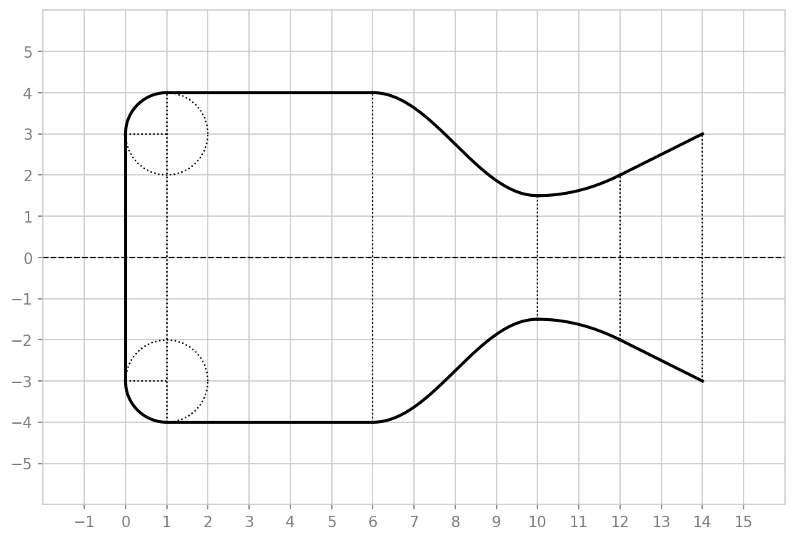
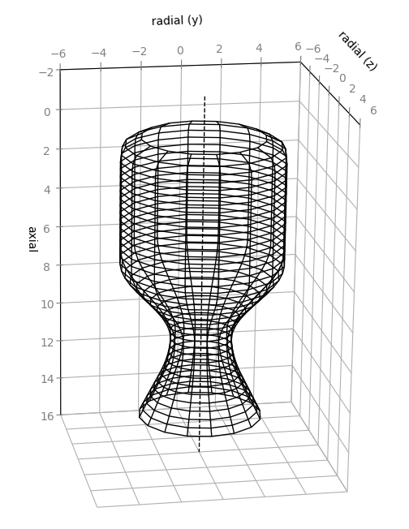

# Filleted Rocket Engine Thrust Chamber Contour Model

[](https://www.python.org/)
[](https://numpy.org/)
[](https://matplotlib.org/)
[](#project-layout)

<p align="center">
  &emsp;
  
</p>

A small modelling tool that model's the 2D axial contour of a liquid fuel rocket engine with a filleted thrust chamber. From three radii, chamber, throat, and exhaust, it assembles five analytic contour segments, mirrors them about the engine axis, and renders the result as a PNG.

```math
y(x) =
\begin{cases}
r_2 + \sqrt{r_1^2 - (x - r_1)^2}, & s_0 \le x \le s_1 & \text{(injector fillet)} \\
r_0, & s_1 \le x \le s_2 & \text{(combustion chamber)} \\
r_3 + \tfrac{r_0 - r_3}{2}\!\left(1 + \cos\tfrac{(x - s_2)\pi}{s_3 - s_2}\right), & s_2 \le x \le s_3 & \text{(neck)} \\
a_0 x^2 + b_0 x + c_0, & s_3 \le x \le s_4 & \text{(throat)} \\
a_1 x + b_1, & s_4 \le x \le s_5 & \text{(nozzle adaptor)}
\end{cases}
```

The model began life as a MATLAB script. Since that environment is no longer available, the maintained renderer is a faithful Python / Matplotlib port; the original `.m` sources are kept under `src/legacy/` for reference.

<br>

<a id="table-of-contents"></a>

## 📋 Table of Contents

- [✅ Requirements](#requirements)
- [⚙️ Setup](#setup)
- [▶️ Running](#running)
- [🧩 Geometry Parameters](#geometry-parameters)
- [🧮 Mathematical Overview](#mathematical-overview)
- [📐 Thrust-Chamber Contour - Mathematical Definition](#contour-mathematical-definition)
- [🗂️ Project Layout](#project-layout)
- [⚠️ Notes and Limitations](#notes-and-limitations)
- [📜 License](#license)

<br>

<a id="requirements"></a>

## ✅ Requirements

- Python 3.9 or newer
- [NumPy](https://numpy.org/) and [Matplotlib](https://matplotlib.org/)
- MATLAB is **optional** — only needed to run the original `src/legacy/*.m` sources; the Python port has no MATLAB dependency

<br>

<a id="setup"></a>

## ⚙️ Setup

Create a virtual environment, then install the two runtime dependencies.

### Windows PowerShell

```powershell
python -m venv .venv
.\.venv\Scripts\python.exe -m pip install -r requirements.txt
```

### Linux or macOS

```bash
python3 -m venv .venv
./.venv/bin/python -m pip install -r requirements.txt
```

### Windows Git Bash

```bash
py -3 -m venv .venv
./.venv/Scripts/python.exe -m pip install -r requirements.txt
```

<br>

<a id="running"></a>

## ▶️ Running

The renderer uses Matplotlib's headless `Agg` backend, so it writes a PNG directly — no display required. Run it from the project directory.

Show the available command-line options:

```bash
python src/engine_contour.py --help
```

Render with the default radii (RC = 4.0, RT = 1.5, RE = 3.0):

```bash
python src/engine_contour.py
```

Render a custom chamber, throat, and exhaust radius and choose the output file:

```bash
python src/engine_contour.py --rc 4 --rt 1 --re 2 --out images/engine-contour.png
```

With no `--out`, the figure is saved to `images/engine-contour.png` (resolved relative to the script).

The repository also includes an interactive 3D wireframe viewer that revolves the same inner-surface profile about the engine axis. It opens a rotatable Matplotlib window (a GUI backend is required), ready to screenshot:

```bash
python src/engine_chamber_3d.py                       # defaults: RC=4.0, RT=1.5, RE=3.0
python src/engine_chamber_3d.py --rc 4 --rt 1 --re 2  # custom radii
python src/engine_chamber_3d.py --sides 16 --stations 40
```

<br>

<a id="geometry-parameters"></a>

## 🧩 Geometry Parameters

The three radii are the meaningful inputs; the axial section boundaries are fixed in the model.

| Option | Symbol | Meaning | Default |
|---|---|---|---|
| `--rc` | $r_0$ | Combustion chamber radius | `4.0` |
| `--rt` | $r_3$ | Throat radius | `1.5` |
| `--re` | $r_4$ | Nozzle adaptor exhaust radius | `3.0` |
| `--out` | — | Output PNG path | `images/engine-contour.png` |

The fixed axial section boundaries (in chamber-radius units) partition the contour into its five segments:

| Boundary | Axial position | Marks the end of |
|---|---|---|
| $s_0$ | `0` | Injector face (origin) |
| $s_1$ | `1` | Injector fillet |
| $s_2$ | `6` | Combustion chamber |
| $s_3$ | `10` | Neck |
| $s_4$ | `12` | Throat |
| $s_5$ | `14` | Nozzle adaptor (exit plane) |

<br>

<a id="mathematical-overview"></a>

## 🧮 Mathematical Overview

The wall profile is built from five analytic pieces, joined end to end and mirrored about the axis ($y \mapsto -y$). Two derived radii tie the inputs together: the injector fillet radius is fixed to the injector length, $r_1 = s_1$, and the flat injection-face radius is $r_2 = r_0 - r_1$.

The **injector fillet** is a quarter-circle arc of radius $r_1$ centred at $(r_1, r_2)$, blending the flat injection face up to the chamber wall:

```math
y(x) = r_2 + \sqrt{r_1^2 - (x - r_1)^2}, \qquad s_0 \le x \le s_1
```

The **combustion chamber** is a constant-radius wall:

```math
y(x) = r_0, \qquad s_1 \le x \le s_2
```

The **neck** is a raised-cosine (half-period) transition from the chamber radius $r_0$ down to the throat radius $r_3$, giving zero slope at both ends:

```math
y(x) = r_3 + \frac{r_0 - r_3}{2}\left(1 + \cos\frac{(x - s_2)\,\pi}{s_3 - s_2}\right), \qquad s_2 \le x \le s_3
```

The **throat** is a parabola $f(x)$, and the **nozzle adaptor** is a line $g(x)$:

```math
f(x) = a_0 x^2 + b_0 x + c_0, \qquad s_3 \le x \le s_4
```

```math
g(x) = a_1 x + b_1, \qquad s_4 \le x \le s_5
```

The parabola and line coefficients are not free — they are solved from continuity and smoothness constraints, derived next.

<br>

<a id="contour-mathematical-definition"></a>

## 📐 Thrust-Chamber Contour - Mathematical Definition

The throat parabola $f(x)$ and the nozzle line $g(x)$ are determined by three control points and a set of geometric constraints. Let:

```math
p_0 = (x_0, y_0) = (s_3,\, r_3), \quad
p_1 = (x_1, y_1) = (s_4,\, y_1), \quad
p_2 = (x_2, y_2) = (s_5,\, r_4)
```

Point $p_0$ is the throat, $p_1$ is the parabola-to-line junction, and $p_2$ is the nozzle exit. The junction height $y_1$ is itself unknown and is solved together with the coefficients.

The six constraints are:

```math
\begin{aligned}
f'(x_0) &= 0          && \text{throat is a turning point (minimum radius)} \\
f(x_0)  &= y_0        && \text{parabola passes through the throat} \\
f(x_1)  &= y_1        && \text{parabola meets the junction} \\
g(x_1)  &= y_1        && \text{line meets the junction} \\
g(x_2)  &= y_2        && \text{line meets the exit plane} \\
g'(x_1) &= f'(x_1)    && \text{slope is continuous at the junction (smooth join)}
\end{aligned}
```

Solving this linear system in closed form (the role of the legacy `exhaustSolver.m`) gives, with $\Delta = (x_0 - x_1)(x_0 + x_1 - 2x_2)$:

```math
a_0 = -\frac{y_0 - y_2}{\Delta}, \qquad
b_0 = \frac{2 x_0 (y_0 - y_2)}{\Delta}
```

```math
c_0 = -\frac{-y_2 x_0^2 + 2 x_2 y_0 x_0 + y_0 x_1^2 - 2 x_2 y_0 x_1}{\Delta}
```

```math
a_1 = \frac{2 (y_0 - y_2)}{x_0 + x_1 - 2 x_2}, \qquad
b_1 = \frac{x_0 y_2 - 2 x_2 y_0 + x_1 y_2}{x_0 + x_1 - 2 x_2}
```

```math
y_1 = \frac{2 x_1 y_0 + x_0 y_2 - 2 x_2 y_0 - x_1 y_2}{x_0 + x_1 - 2 x_2}
```

These coefficients guarantee a $C^1$-continuous profile: the parabola bottoms out exactly at the throat radius and hands off to the nozzle line with a matching slope, so the rendered wall has no visible kink at the junction.

<br>

<a id="project-layout"></a>

## 🗂️ Project Layout

```
rocket-engine-thrust-chamber/
├─ src/                          Maintained Python renderers and legacy MATLAB sources
│  ├─ engine_contour.py          2D contour renderer (Matplotlib port); CLI entry point
│  ├─ engine_chamber_3d.py       Interactive 3D wireframe viewer
│  └─ legacy/                    Original MATLAB sources (kept for reference)
│     ├─ engineContour.m         MATLAB contour model
│     ├─ circle.m                Fillet construction circles
│     ├─ exhaustSolver.m         Throat/nozzle coefficient solver
│     ├─ testFig.m               Legacy MATLAB GUIDE harness (script)
│     └─ testFig.fig             Legacy MATLAB GUIDE harness (figure)
│
├─ images/                       Rendered output and published MATLAB HTML
│  ├─ engine-contour.png         2D axial contour (README headline)
│  ├─ inner-surface.png          3D wireframe render
│  └─ html/                      Published MATLAB HTML
│
├─ requirements.txt              Runtime dependencies (NumPy, Matplotlib)
├─ README.md                     This document
└─ LICENSE                       MIT license
```

<br>

<a id="notes-and-limitations"></a>

## ⚠️ Notes and Limitations

- The original MATLAB `engineContour()` accepts section boundaries `s1..s5` as arguments but then immediately overrides them with hard-coded values. The Python port reproduces this behaviour faithfully: only the three radii are meaningful inputs, and the axial boundaries are fixed.
- The model is a 2D axial profile for visualisation and geometry study — not a thermal, structural, or gas-dynamic analysis. The radii and boundaries are dimensionless model units, not a specific engine.
- The throat "parabola" and nozzle "line" describe the adaptor geometry only; they are not a method-of-characteristics or bell-nozzle optimisation.

<br>

<a id="license"></a>

## 📜 License

Released under the [MIT License](LICENSE). © 2019 Rohin Gosling.
</content>
